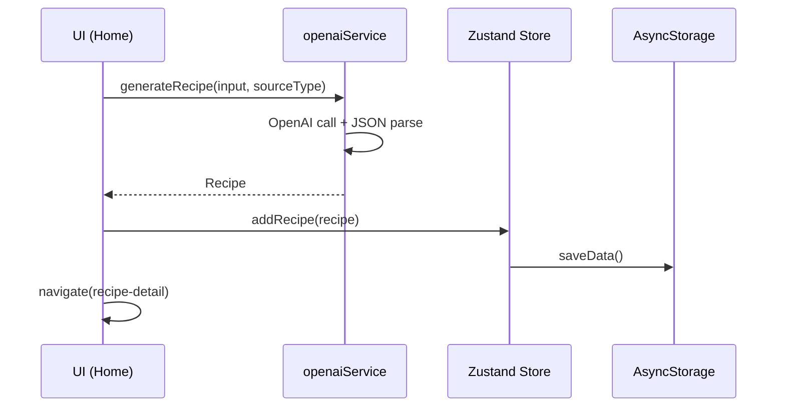

# ChefMate – Architektur 01: Overview

## Ziel
ChefMate ist eine Expo/React-Native App, die aus beliebigen Rezept-Inputs (Text, Pantry-Liste, Foto/OCR, Social-Link) ein **strukturiertes Rezeptobjekt** erzeugt und daraus **drei Varianten** ableitet:
- **Student/Simple** (schnell, günstig, minimaler Aufwand)
- **Airfryer/Gadget** (optimiert für Airfryer/Devices)
- **Profi/Authentic** (authentisch, Technik, Geschmack)

Zusätzlich bietet die App:
- **Wochenplaner** (7 Tage × Frühstück/Mittag/Abend)
- **Aggregierte Einkaufsliste** (Mengen zusammenführen, kategorisieren, abhaken)

## Tech-Stack
- **Runtime/Framework:** React Native + Expo (Managed Workflow)
- **Sprache:** TypeScript
- **UI Styling:** NativeWind (Tailwind-ähnliche `className`-Styles)
- **State:** Zustand
- **Storage:** AsyncStorage
- **AI:** OpenAI Chat Completions (`gpt-4o`) mit JSON-Response

## Komponenten (High Level)

### 1) UI Layer (Screens/Components)
- Root Navigation/Flow über `AppView` im Root-State (keine externe Navigation-Library)
- Screens:
  - Home: Import/Generate + Verlauf
  - Planner: Wochenplan
  - ShoppingList: aggregierte Einkaufsliste
  - RecipeDetail: Rezept-Detail + Version Switch + „Zum Plan hinzufügen“

### 2) Domain Model
- `Recipe` mit `versions.student/profi/airfryer` und streng strukturierten Ingredient-Listen
- `PlannerDay` mit `slots.breakfast/lunch/dinner`
- `ShoppingItem` als aggregierte Zeile mit `checked`

### 3) State + Storage
- Zustand Store hält `recipes`, `planner`, `shoppingList`
- Persistenz über AsyncStorage (`recipes`, `planner`, `shoppingList`)

### 4) AI Service
- `generateRecipe(input, sourceType)` ruft OpenAI auf
- Response ist JSON (Schema strikt im System Prompt)
- Ergebnis wird in `Recipe` gemappt und im Store gespeichert

## Ordner-/Modulstruktur (Ist-Stand)

- `App.tsx`: Root View-Switch + Bottom Navigation
- `src/types/recipe.ts`: zentrale Domain Types
- `src/store/appStore.ts`: Zustand Store + Aggregation + Persistenz
- `src/services/openaiService.ts`: OpenAI Integration + Prompting
- `src/screens/*`: Screens
- `src/components/*`: UI-Komponenten

## Datenfluss (End-to-End)

### Rezept erstellen (Beispiel: Text Suche)
1. UI: Nutzer gibt „Lasagne“ ein
2. UI: Home ruft `generateRecipe('Lasagne','text')`
3. Service: OpenAI generiert JSON (3 Varianten)
4. UI: Speichert per `addRecipe(recipe)` in Zustand
5. UI: Navigiert zu RecipeDetail

### Zu Plan hinzufügen
1. UI: RecipeDetail wählt Tag/Slot
2. Store: `addToPlan(day, slot, recipeId, version)`
3. Store: `regenerateShoppingList()` aggregiert Zutaten
4. Store: `saveData()` persistiert

### Einkaufsliste abhaken
1. UI: Tippt Item
2. Store: `toggleShoppingItem(index)`
3. Store: `saveData()`

## Sequenzdiagramm (vereinfacht)

## Nicht-Ziele / bekannte Einschränkungen
- Social/OCR Import ist aktuell UI-seitig „Mocked“ (Input wird erfragt) – keine echte Transcript/OCR Pipeline.
- `Alert.prompt` ist iOS-spezifisch. Für Android braucht es später ein eigenes Input-Modal.
- OpenAI Key ist als `EXPO_PUBLIC_*` im Client **nicht sicher** (siehe AI-Dokument). Für Produktion braucht es ein Backend/Proxy.
