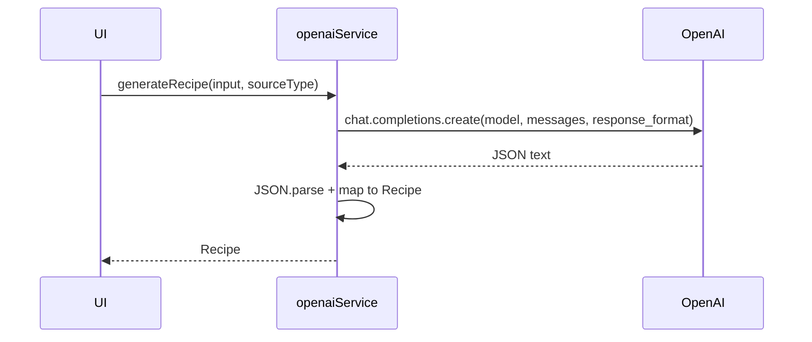

# ChefMate – Architektur 04: AI Integration (OpenAI)

## Zweck
Beschreibt:
- wie der OpenAI Call funktioniert,
- wie das JSON-Format erzwungen wird,
- welche Risiken es bei Client-seitigen API Keys gibt.

## Service
Quelle: `src/services/openaiService.ts`

### Public API
- `generateRecipe(input, sourceType): Promise<Recipe>`

### Prompting
- System Prompt definiert:
  - drei Rezept-Varianten (Student/Profi/Airfryer)
  - striktes JSON Output Format
  - Kategorien für Ingredients

### Response Format
Es wird `response_format: { type: 'json_object' }` verwendet.
- Ziel: Modell soll gültiges JSON liefern.
- Danach wird `JSON.parse(content)` durchgeführt.

### Mapping
AI JSON → Domain:
- `originalName` → `Recipe.originalName`
- `versions` → `Recipe.versions`
- Client ergänzt `recipeId`, `createdAt`, `sourceType`

## Source Types
- `text`: “Create a recipe for: <input>”
- `pantry`: “Create a recipe using these ingredients: <input>”
- `ocr`: “menu item or dish photo description … reverse-engineer …”
- `social`: “content from social media … extract …”

## Fehlerbehandlung
- Wenn kein API-Key konfiguriert ist: expliziter Fehler
- Wenn OpenAI keine `message.content` liefert: Fehler
- Catch: wirft generischen Fehler für die UI

## Security / Deployment Notes (wichtig)
### Client-Key ist unsicher
`EXPO_PUBLIC_OPENAI_API_KEY` ist absichtlich „public“ und landet im App-Bundle.
Das bedeutet:
- jeder kann den Key extrahieren,
- Missbrauch/Kosten sind möglich,
- Rate Limits/Abuse sind schwer zu kontrollieren.

### Empfohlenes Produktions-Setup
- Backend/Edge Function als Proxy:
  - Client authentifiziert sich (z.B. Supabase Auth)
  - Server hält OpenAI Key privat
  - Server validiert Input, loggt, throttled
- Optional: Signierte Requests oder Session Tokens

### Datenschutz
Rezept-Inputs können personenbezogene Informationen enthalten (z.B. Fotos/Notizen). Produktion sollte:
- Datenminimierung
- Löschkonzepte
- Transparente UI Hinweise

## Sequenz (AI)

## Test-Strategie (empfohlen)
- Unit-Test für JSON parsing/mapping
- Contract-Test mit fixture JSON
- Mock OpenAI SDK im Test
