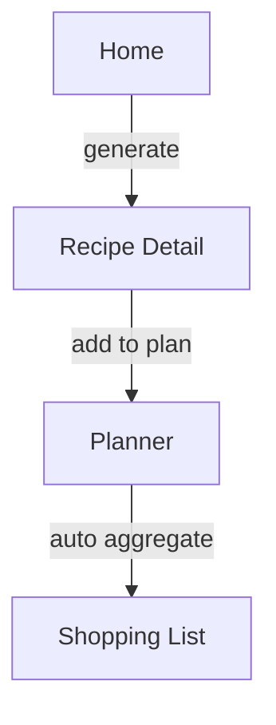

# ChefMate – Architektur 05: UI, Navigation & Screens

## Zweck
Beschreibt:
- UI-Aufbau und Navigation,
- Screen-Verantwortlichkeiten,
- Interaktionsflüsse.

## Navigation-Ansatz
Quelle: `App.tsx`

- Navigation wird über lokalen State gesteuert:
  - `view: AppView = 'home' | 'planner' | 'shopping' | 'recipe-detail'`
  - `currentRecipe: Recipe | null`
- Bottom Navigation wird nur gezeigt, wenn `view !== 'recipe-detail'`.

Vorteile:
- sehr einfach, kein Setup

Nachteile:
- keine Deep Links
- kein Stack History (außer man baut es nach)
- Scaling später schwieriger (dann z.B. React Navigation)

## Screens

### HomeScreen
Quelle: `src/screens/HomeScreen.tsx`

Verantwortung:
- Textsuche
- Schnell-Import: Kamera (OCR-placeholder), Pantry (Input), Social Link (Input)
- Verlauf (letzte Rezepte)

Technik:
- Kamera über `expo-image-picker`
- Rezeptgenerierung via `generateRecipe()`

Einschränkung:
- `Alert.prompt` ist iOS-spezifisch.

### PlannerScreen
Quelle: `src/screens/PlannerScreen.tsx`

Verantwortung:
- Darstellung 7 Tage
- Anzeige Slots Frühstück/Mittag/Abend
- Entfernen aus Plan

### ShoppingListScreen
Quelle: `src/screens/ShoppingListScreen.tsx`

Verantwortung:
- Gruppierung nach `category`
- Abhaken via `toggleShoppingItem`

### RecipeDetailScreen
Quelle: `src/screens/RecipeDetailScreen.tsx`

Verantwortung:
- Version auswählen (Student/Profi/Airfryer)
- Zutaten/Steps anzeigen (via `RecipeCard`)
- Zum Plan hinzufügen (Tag/Slot Auswahl)

## Komponenten

### Navigation
Quelle: `src/components/Navigation.tsx`
- Simple 3 Tabs: Home / Planer / Einkauf

### RecipeCard
Quelle: `src/components/RecipeCard.tsx`
- Version-Switch
- Darstellung Ingredients + Steps + Tips

## UI Flow (Beispiel)

## NativeWind Styling
- `className` in RN Components
- `babel.config.js` aktiviert NativeWind Babel Plugin
- `tailwind.config.js` definiert Content-Paths und Theme-Colors (`chef.*`)
