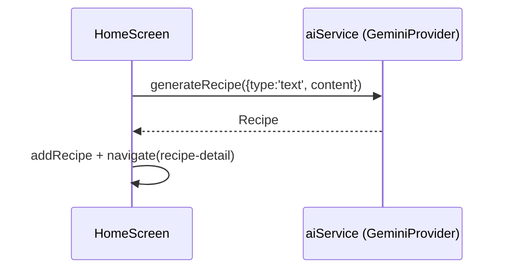
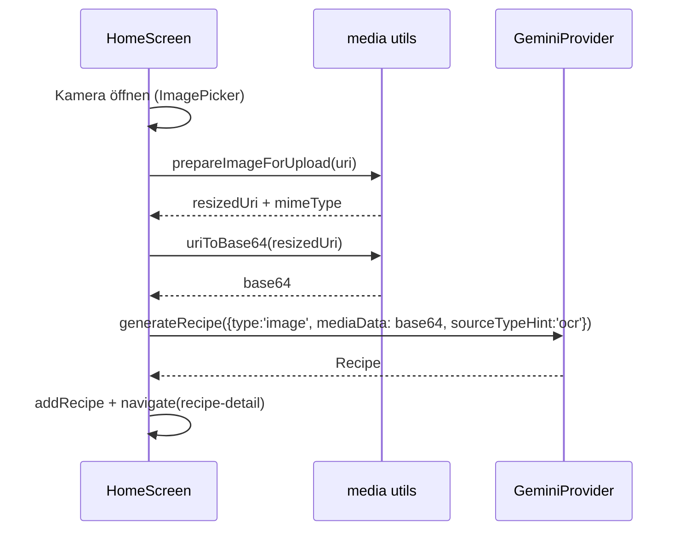
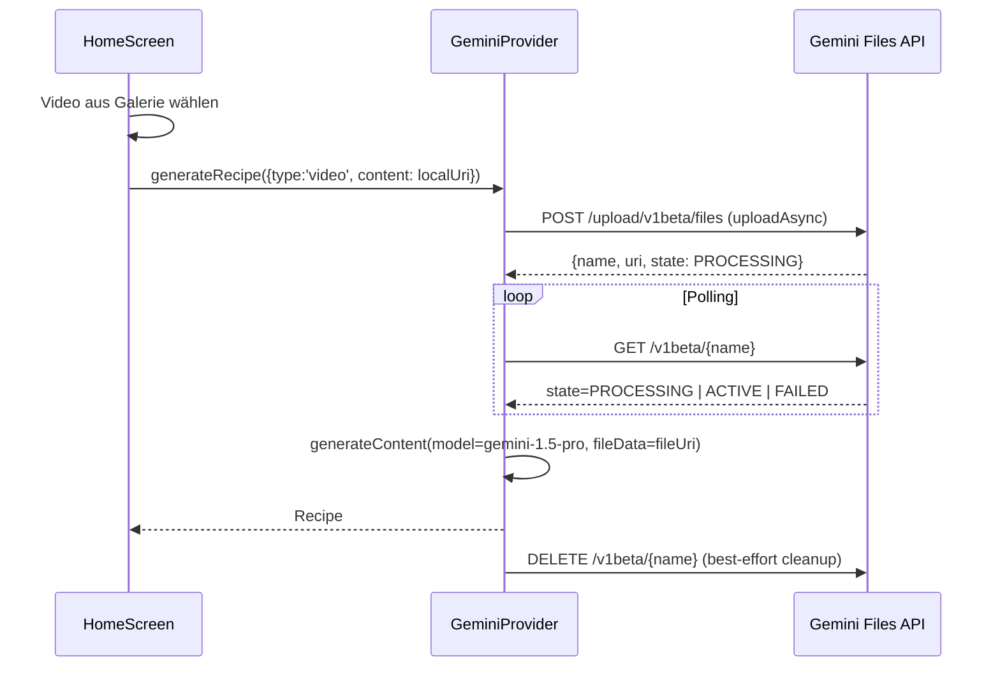

# ChefMate – Architektur 09: Datenflüsse & Sequenzen (Multimodal)

## Zweck
Dieses Dokument beschreibt die End-to-End Flows für:
- Text → Rezept
- Menu Scan (Bild) → Rezept
- Pantry Foto (Bild) → Rezept
- Reel-to-Recipe (Video) → Rezept

## Flow: Text
Quelle: [src/screens/HomeScreen.tsx](../../src/screens/HomeScreen.tsx)

## Flow: Menu Scan (Bild)

## Flow: Pantry Check (Bild)
Identisch zum Menu Scan, aber mit anderer Aufgabenbeschreibung und Attribution:
- `sourceTypeHint: 'pantry'`

## Flow: Reel-to-Recipe (Video)

## Fehlerpfade (kurz)
- Missing API key → Provider wirft Fehler
- JSON Parse fails → Utility versucht zu extrahieren, sonst Fehler
- Video: `FAILED` → Fehler + Abbruch
- Video: Timeout → Fehler + Abbruch

UI zeigt derzeit eine generische Meldung „Rezept konnte nicht generiert werden“.

## Datenpersistenz
Nach erfolgreicher Generierung:
- `addRecipe(recipe)` speichert im Zustand Store
- Store persistiert via AsyncStorage

Siehe bestehende Dokumente:
- 03-state-storage
- 02-data-model
